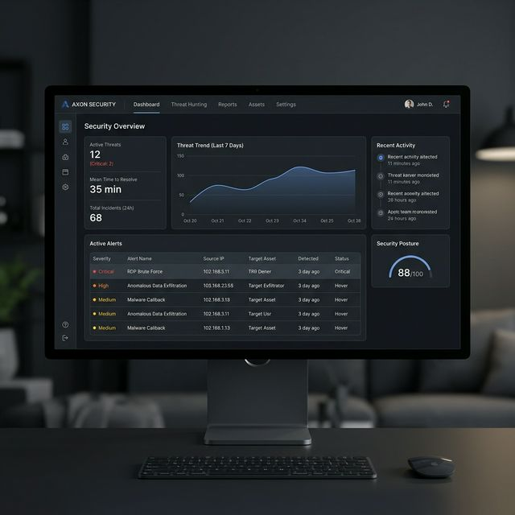

<br/>
<div align="center">
  <h1 align="center">🛡️ Mini SOC: AI-Powered Threat Detection & Response</h1>
  <p align="center">
    A production-grade Security Information and Event Management (SIEM) and SOAR platform built with Python, Flask, React, and Machine Learning.
  </p>
  <p align="center">
    
    
    
    
  </p>
</div>

<br/>

## 🎯 Project Overview
Mini SOC is an end-to-end cybersecurity pipeline designed to ingest raw logs, enrich them with Threat Intelligence, detect malicious behavior using both static rules and statistical anomaly detection, and automatically execute containment playbooks.

It gives analysts a **"single pane of glass"** React dashboard to monitor the network in real-time.

 *(Note: Replace with actual screenshot of your React UI running!)*

---

## 🏗️ System Architecture

Mini SOC utilizes a highly modular pipeline imitating enterprise platforms like Splunk, Datadog Security, or Cortex XSOAR.

```mermaid
graph TD;
    subgraph Data Ingestion
      Logs[Raw Syslog & JSON] --> API(Ingestion API)
      API --> Normalizer(Log Normalizer)
      Normalizer --> TI{Threat Intel API}
    end
    
    subgraph Storage
      Normalizer --> MongoDB[(MongoDB Events)]
    end

    subgraph Detection Engine
      Normalizer --> Engine(Detection Rule Engine)
      Engine --> Rule1(SSH Brute Force)
      Engine --> Rule2(Port Scanning)
      Engine --> Rule3(Privilege Escalation)
      Engine --> Rule4(ML Anomaly Detection)
      Engine --> Rule5(Threat Intel Matcher)
    end

    subgraph Response Layer (SOAR)
      Rule1 --> Dispatcher(Alert Dispatcher)
      Rule2 --> Dispatcher
      Rule3 --> Dispatcher
      Rule4 --> Dispatcher
      Rule5 --> Dispatcher
      Dispatcher --> SOAR{SOAR Engine}
      SOAR --> Playbook1(Auto-Block IP)
      SOAR --> Playbook2(Lock User Account)
      Playbook1 --> DB_M[(MongoDB Mitigations)]
    end

    subgraph Frontend (React Analyst Dashboard)
      MongoDB --> Dashboard([Alert Feed])
      DB_M --> Dashboard([Active Defenses])
    end
```

---

## ⚡ Core Capabilities

### 1. 🔍 Data Ingestion & Enrichment
- Normalizes disparate log sources (`auth.log`, structured JSON, syslog) into a unified forensic schema.
- Uses a **Mock Threat Intelligence Platform** (simulating VirusTotal/AbuseIPDB) to dynamically query external IPs and tag incoming logs with reputation scores and actor archetypes (e.g. `TOR_EXIT_NODE`).

### 2. 🧠 Hybrid Threat Detection
Uses a multi-layered approach to threat hunting:
- **Rule-Based Trips:** Detects traditional lateral movement (Port Scans), high-velocity attacks (Brute Force), and localized internal attacks (Privilege Escalation via `sudo`).
- **Threat Intel Matching:** Instantly flags incoming logs from known malicious IPs.
- **Machine Learning (Isolation Forests):** An offline-trained baseline model detects statistical anomalies in network behavior, flagging attacks that try to fly "under the radar" of static rules.

### 3. 🤖 Automated Remediation (SOAR)
When high-severity alerts trigger, the built-in SOAR engine immediately executes response playbooks. 
- Automatically blocklists attacker IPs at the ingestion layer firewall.
- Quarantines and locks internal user accounts displaying signs of compromise.

### 4. 📊 Analyst Dashboard
A beautiful, modern single-page React app (Tailwind CSS, Recharts) providing:
- Real-time polling of the Alert Feed.
- Expandable forensic tables exposing raw log evidence.
- An Active Mitigations feed showing exactly what automated perimeter defenses the AI has taken.

---

## 🚀 Quick Start (Docker Run)

The entire application (Frontend, Flask API, MongoDB, and Pre-trained ML Models) is containerized for instant deployment.

```bash
# 1. Clone the repository
git clone https://github.com/tanmaymish/mini-soc.git
cd mini-soc

# 2. Spin up the entire pipeline
docker-compose up --build -d

# 3. Access the React Dashboard
Open http://localhost:5173 in your browser
```

---

## 🕹️ Simulating Cyber Attacks

Once the SOC is running, you can fire built-in attack scenarios directly at the ingestion engine to watch the dashboard light up!

```bash
# Enter the Flask Container
docker exec -it mini-soc-api bash

# Simulate an SSH Brute Force Attack
python scripts/simulate_attack.py --mode brute_force

# Simulate an APT Port Scan
python scripts/simulate_attack.py --mode port_scan

# Simulate a Known Threat Actor hitting the perimeter
python scripts/simulate_attack.py --mode threat_intel

# Unleash everything at once to stress test the SOC
python scripts/simulate_attack.py --mode all
```

---

## 🛠️ Technology Stack
- **Backend:** Python 3.10+, Flask, Waitress
- **Machine Learning:** Scikit-Learn (Isolation Forest), Pandas, Joblib
- **Frontend:** React 18, Vite, Tailwind CSS, Recharts, date-fns
- **Data Storage:** MongoDB (PyMongo)
- **Infrastructure:** Docker & Docker Compose

---

<div align="center">
  <b>Built for practical, hands-on Security Engineering.</b><br/>
  Detect the breach. Contain the threat. Automate the response.
</div>
