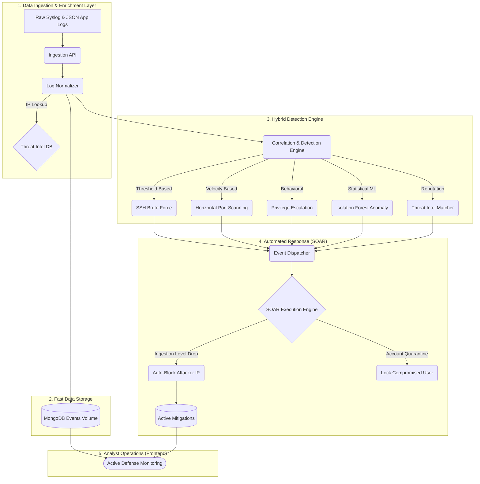

<br/>
<div align="center">
  
  
  <h1 align="center">🛡️ Mini SOC: AI-Powered Threat Detection & Response</h1>
  
  <p align="center">
    <strong>A production-grade, end-to-end Security Information and Event Management (SIEM) and SOAR platform.</strong>
  </p>

  <p align="center">
    <a href="https://github.com/tanmaymish/mini-soc/releases"></a>
    
    
    
    
    
  </p>
</div>

<br/>

## 🎯 Project Overview
Mini SOC is an elite cybersecurity pipeline designed to ingest raw logs, enrich them with Threat Intelligence, detect malicious behavior using both static rules and statistical anomaly detection, and automatically execute containment playbooks.

It provides security analysts with a **"single pane of glass"** React dashboard to monitor network telemetry in real-time, bridging the gap between raw data and actionable threat intelligence.

---

## 🏗️ System Architecture

Mini SOC utilizes a highly modular, decoupled pipeline architecture imitating enterprise platforms like Splunk, Datadog Security, or Cortex XSOAR.



---

## 📦 Releases & Packaging

Mini SOC is built with modern release engineering in mind.

- **[v1.0.0-rc.1] (Current):** Stable release featuring the complete Ingestion, Detection, and SOAR automation flow.
- **Docker Images:** The entire stack is packaged into optimized, multi-stage Docker containers.
- **Microservices Deployment:** Separating the React UI, Python API Engine, and MongoDB into stateless containers allows horizontal scaling of the detection engine for high-throughput networks.

---

## ⚡ Core Capabilities

### 1. 🔍 Data Ingestion & Enrichment
- Normalizes disparate log sources (`auth.log`, structured JSON, syslog) into a unified forensic schema.
- Uses a **Threat Intelligence Module** to dynamically query external IPs and tag incoming logs with reputation scores and actor archetypes (e.g. `TOR_EXIT_NODE`, `BOTNET`).

### 2. 🧠 Hybrid Threat Detection
Uses a multi-layered approach to threat hunting:
- **Rule-Based Trips:** Detects traditional lateral movement (Port Scans), high-velocity attacks (Brute Force), and localized internal attacks (Privilege Escalation via `sudo`).
- **Machine Learning (Isolation Forests):** An offline-trained baseline model detects statistical anomalies in network behavior, flagging attacks that try to fly "under the radar".
- **Threat Intel Matching:** Instantly flags incoming logs from known malicious IPs.

### 3. 🤖 Automated Remediation (SOAR)
When high-severity alerts trigger, the built-in SOAR engine immediately executes response playbooks. 
- Automatically blocklists attacker IPs at the ingestion layer firewall, dropping their packets before analysis.
- Quarantines and locks internal user accounts displaying signs of compromise.

---

## 🚀 Quick Start (Docker Run)

The entire application is fully containerized for instant deployment. 

```bash
# 1. Clone the repository
git clone https://github.com/tanmaymish/mini-soc.git
cd mini-soc

# 2. Spin up the entire pipeline
docker-compose up --build -d

# 3. Access the React Dashboard
# Open http://localhost:5173 in your browser
```

---

## 🕹️ Simulating Cyber Attacks

Once the SOC is running, use the built-in attack simulator to generate realistic telemetry and watch the SIEM react in real-time.

```bash
# Enter the Flask Container
docker exec -it mini-soc-api bash

# Simulate an SSH Brute Force Attack
python scripts/simulate_attack.py --mode brute_force

# Simulate an APT Port Scan
python scripts/simulate_attack.py --mode port_scan

# Simulate an ML Data Exfiltration Anomaly
python scripts/simulate_attack.py --mode anomaly

# Simulate a Known Threat Actor hitting the perimeter
python scripts/simulate_attack.py --mode threat_intel

# Unleash everything at once to stress test the SOC
python scripts/simulate_attack.py --mode all
```

---

## 🛠️ Technology Stack
- **Backend:** Python 3.10+, Flask, Waitress
- **Machine Learning:** Scikit-Learn (Isolation Forest), Pandas, NumPy
- **Frontend:** React 18, Vite, Tailwind CSS, Recharts, Lucide Icons
- **Data Storage:** MongoDB (PyMongo)
- **Infrastructure:** Docker, Docker Compose

---

<div align="center">
  <b>Built for practical, next-generation Security Engineering.</b><br/>
  Detect the breach. Contain the threat. Automate the response.
</div>
